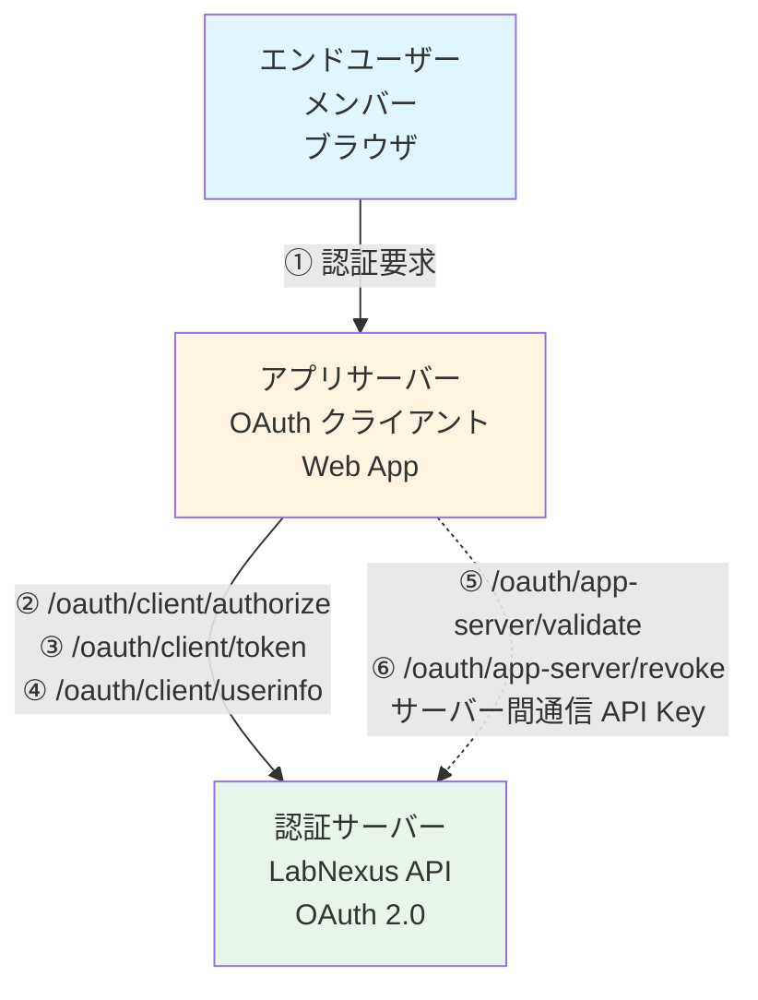
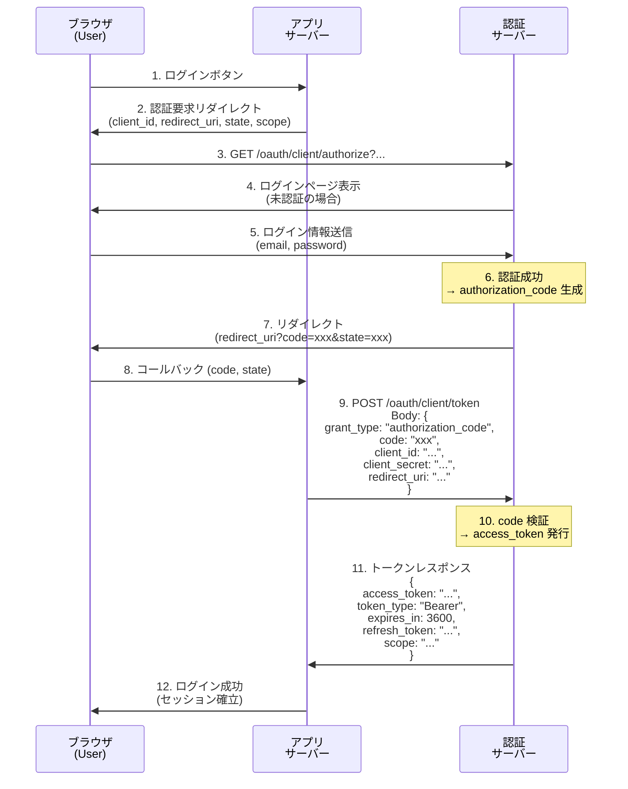
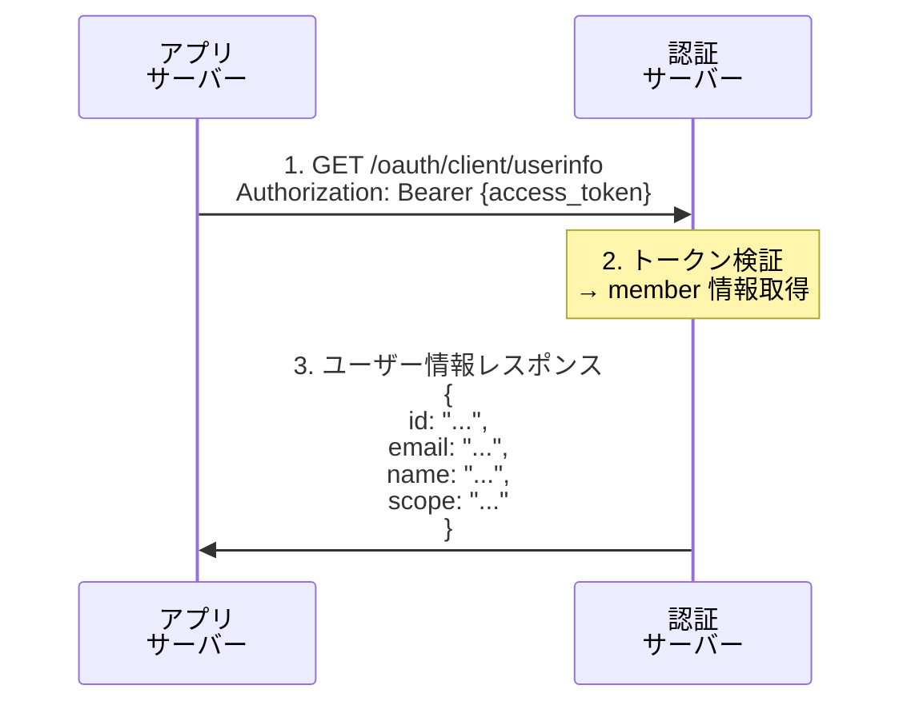
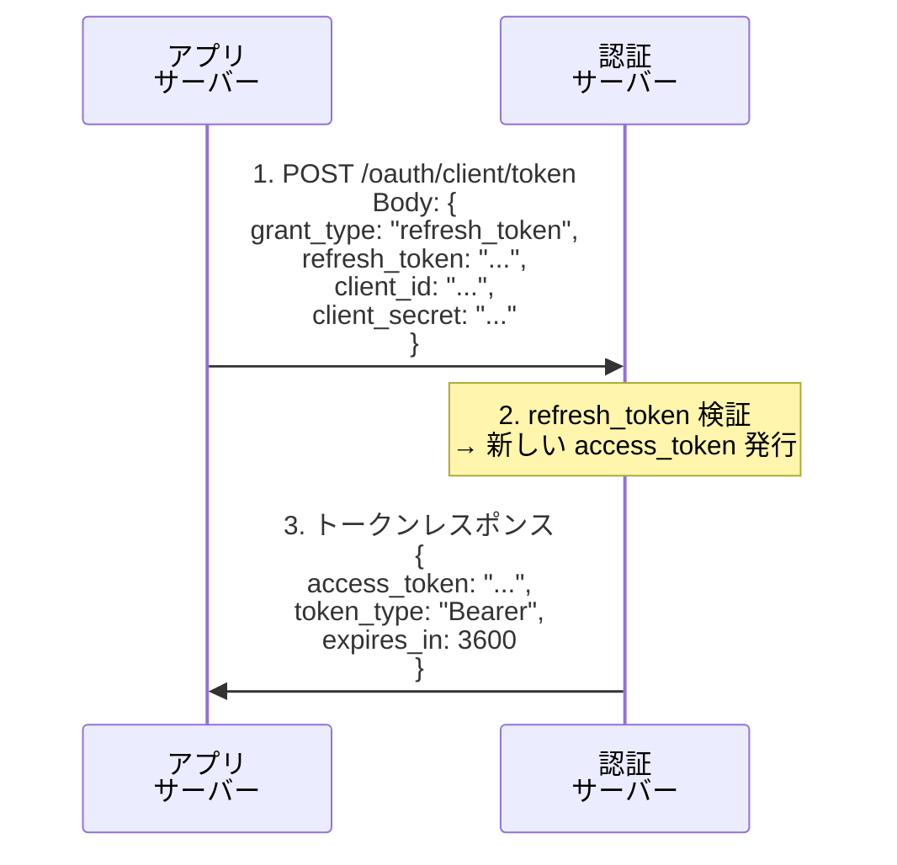
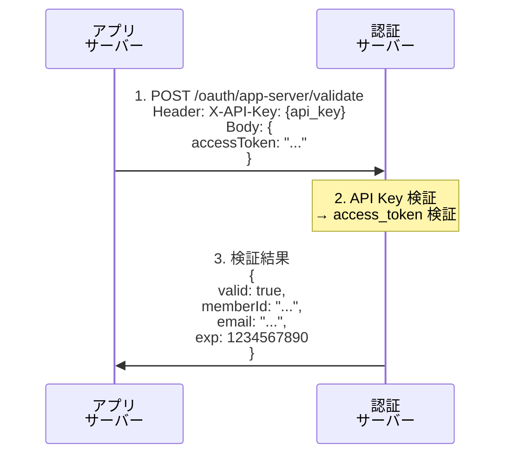
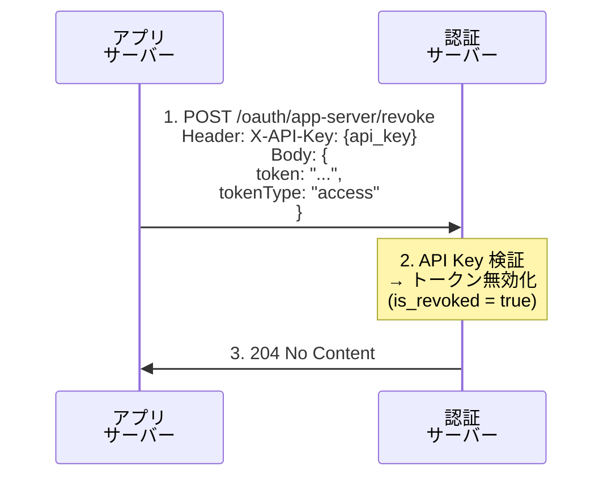

# OAuth 2.0 フロー解説

本システムでは、OAuth 2.0 の Authorization Code Flow を基にした簡易的な認証・認可の仕組みを実装しています。このドキュメントでは、システム固有の簡略化や共通化について解説します。

## 概要

LabNexus の OAuth 2.0 実装は以下の特徴を持ちます：

- **簡略化されたフロー**: 標準的な OAuth 2.0 を研究室管理システム向けに簡略化
- **3 つのアクターモデル**: エンドユーザー（メンバー）、クライアント（アプリサーバー）、認証サーバー（LabNexus API）
- **サービスアカウントとの統合**: OAuth クライアントは必ずサービスアカウントに紐づく
- **API Key ベースのサービス間認証**: アプリサーバーから認証サーバーへのリクエストは API Key で認証

## システムアーキテクチャ

## OAuth 2.0 フロー

### フロー 1: Authorization Code Flow（クライアントからのリクエスト）

エンドユーザーがアプリケーションサーバーにログインする際のフローです。

#### シーケンスの詳細

**ステップ 1-2: ログイン開始**

- ユーザーがアプリサーバーのログインボタンをクリック
- アプリサーバーは認証サーバーの `/oauth/client/authorize` へリダイレクト

**ステップ 3-5: 認証**

- 認証サーバーはユーザーが未認証の場合、ログインページを表示
- ユーザーは email と password でログイン

**ステップ 6-7: 認証コード発行**

- 認証成功時、認証サーバーは `authorization_code` を生成して DB に保存
- `redirect_uri` に code と state を付けてリダイレクト

**ステップ 8-11: トークン交換**

- アプリサーバーは code を受け取り、`/oauth/client/token` へリクエスト
- `client_id` と `client_secret` で OAuth クライアント自身を認証
- 認証サーバーは code を検証し、`access_token` と `refresh_token` を発行

**ステップ 12: ログイン完了**

- アプリサーバーはトークンを保存し、ユーザーセッションを確立

### フロー 2: ユーザー情報取得（クライアントからのリクエスト）

アクセストークンを使ってユーザー情報を取得します。

**ポイント**:

- アクセストークンは Bearer Token として Authorization ヘッダーで送信
- scope に応じて返却される情報が変わる（実装依存）

### フロー 3: トークンリフレッシュ（クライアントからのリクエスト）

アクセストークンの期限が切れた際に、リフレッシュトークンで新しいアクセストークンを取得します。

### フロー 4: トークン検証（アプリサーバーからのリクエスト）

**システム固有の特徴**: アプリサーバーが認証サーバーに直接トークンの有効性を確認するエンドポイントを提供しています。

**ポイント**:

- **サーバー間通信**: API Key で認証（`X-API-Key` ヘッダー）
- OAuth クライアントに紐づくサービスアカウントの API Key を使用
- トークンの有効性だけでなく、ユーザー情報も返却

### フロー 5: トークン無効化（アプリサーバーからのリクエスト）

強制ログアウトなどでトークンを無効化します。

